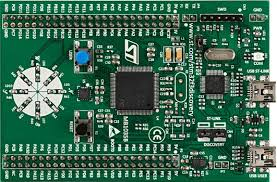

## STM32F3 Discovery Overview

The STM32F3-discovery is cheap evaluation board designed by ST for pushing the STM32F3 microcontoller to a broad audience. It features an STM32F303VC microcontroller with 48Kb of RAM and 256Kb flash memory running with up to 72MHz. Addionially it provides USB host capabilities, 8 LEDs and sensors for a 9-degree of freedom initial measurement unit (3-axis accelerometer, 3-axis gyro and 3-axis magnetometer).

The board does however not provide any radio capabilities, radio devices have to be connected externally via I2C, SPI, UART or similar.

## Hardware




### MCU
| MCU 		| STM32F303VC 		|
|:------------- |:--------------------- |
| Family	| ARM Cortex-M4 	|
| Vendor	| ST Microelectronics	|
| RAM		| 48Kb (40Kb RAM + 8Kb CCM RAM)	|
| Flash		| 256Kb				|
| Frequency	| up to 72MHz (using the on-board 8MHz Oszillator of the ST-Link) |
| FPU		| yes				|
| Timers	| 10 (9x 16-bit, 1x 32-bit [TIM2])	|
| ADCs		| 4x 12-bit			|
| UARTs		| 5 				|
| SPIs		| 3					|
| I2Cs		| 2 				|
| Vcc		| 2.0V - 3.6V			|
| Datasheet 	| [Datasheet](http://www.st.com/web/en/resource/technical/document/datasheet/DM00058181.pdf) |
| Reference Manual | [Reference Manual](http://www.st.com/web/en/resource/technical/document/reference_manual/DM00043574.pdf) |
| Programming Manual | [Programming Manual](http://www.st.com/st-web-ui/static/active/en/resource/technical/document/programming_manual/DM00046982.pdf) |
| Board Manual	| [Board Manual](http://www.st.com/st-web-ui/static/active/en/resource/technical/document/user_manual/DM00063382.pdf)|

### RIOT static pin mapping

please refer to [this](https://docs.google.com/spreadsheets/d/1gnxsux5WpFrn-33Ivb9nGgTBqooqgDYxRkhZms-cvsc/edit?usp=sharing) document for the pin mapping as implemenented in `boards/stm32f3discovery/include/periph_conf.h`

### User Interface

2 Buttons:

| NAME	| USER 	| RESET 	|
|:----- |:----- |:--------- |
| Pin 	| PA0 (IN) | NRST	|

8 LEDs:

| NAME	| LD3	| LD4	| LD5	| LD6	| LD7 	| LD8 	| LD9	| LD10	|
| -----	| -----	| -----	| -----	| -----	| -----	| -----	| -----	| -----	|
| Color	| red	| blue	| orange| green	| green	| orange| blue	| red	|
| Pin	| PE9	| PE8	| PE10	| PE15	| PE11 	| PE14	| PE12	| PE13	|


### E-Compass / Accelerometer

The board has an on-board MEMS-chip that is an integrated accelerometer and e-compass.

| Sensor	| LSM303DLHC		|
|:------------- |:--------------------- |
| Type		| Accelerometer and magnetometer |
| Vendor	| ST Microelectronics	|
| Datasheet	| [Datasheet](http://www.st.com/st-web-ui/static/active/en/resource/technical/document/datasheet/DM00027543.pdf)		|
| Errata Sheet  | [Errata Sheet](http://www.st.com/st-web-ui/static/active/en/fragment/legal/statements/disclaimer/disclaimer_errata.pdf) |
| Connected to	| I2C_0			|
| Pin Config:	||
| Device	| I2C1			|
| SCL		| PB6 (OUT, I2C1_SCL)	|
| SDA		| PB7 (OUT, I2C1_SDA)	|
| DRDY		| PE2 (IN)		|
| INT1		| PE4 (IN)		|
| INT2		| PE5 (IN)		|


### Gyroscope

An 3-axis gyroscope is soldered on the board.

| Sensor	| L3GD20		|
|:------------- |:--------------------- |
| Type		| Gyroscope		|
| Vendor	| ST Microelectronics	|
| Datasheet	| [Datasheet](http://www.st.com/st-web-ui/static/active/en/resource/technical/document/datasheet/DM00036465.pdf)	|
| Errata Sheet  | [Errata Sheet](http://www.st.com/st-web-ui/static/active/en/fragment/legal/statements/disclaimer/disclaimer_errata.pdf) |
| Connected to 	| SPI_0			|
| Pin Config:	||
| Device	| SPI1			|
| SCK		| PA5 (OUT, SPI1_SCK)	|
| MISO		| PA6 (IN,  SPI1_MISO)	|
| MOSI		| PA7 (OUT, SPI1_MOSI)	|
| CS		| PE3 (OUT)		|
| INT1		| PE0 (IN)		|
| INT2/DRDY	| PE1 (IN)		|


## Implementation Status

| Device	| ID		| Supported	| Comments	|
|:------------- |:------------- |:------------- |:------------- |
| MCU		| STM23F303VC	| partly	| Energy saving modes not fully utilized |
| Low-level driver | GPIO	| yes		||
|		| PWM		| yes		||
|		| UART		| full		||
|		| I2C		| no		| in progress	|
|		| SPI		| no		| in progress	|
|		| USB		| no		||
| 		| Timer		| full		||
|		| Inpute Capture| no		||
| Accelerometer	| LSM303DLHC	| no		| planned |
| Magnetometer	| LSM303DLHC	| no		| planned |
| Gyroscope	| L3GD20	| no		| planned |


## Flashing the device


The STM32F3discovery board includes an on-board ST-LINK V2 programmer. The easiest way to program the board is to use OpenOCD. Once you have installed OpenOCD (look [here](https://github.com/RIOT-OS/RIOT/wiki/OpenOCD) for installation instructions), you can flash the board simply by typing

```
make flash
```
and debug via GDB by simply typing
```
make debug
```


## Supported Toolchains

For using the STM32F3discovery board we strongly recommend the usage of the [GNU Tools for ARM Embedded Processors](https://launchpad.net/gcc-arm-embedded) toolchain.


## Using UART

1. connect your usb tty to: RX=PA10 TX=PA9 and GND=GND
   - **PA10** is connected with **TX** on the UART converter 
   - **PA9** is connected with **RX** on the UART converter
2. done